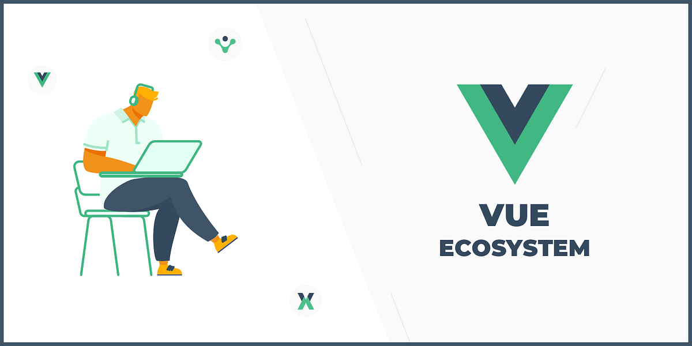

# Vue.js Practice Repository
**Welcome to the Vue.js Practice Repository! This repository is designed to help you enhance your Vue.js skills through practical exercises and the development of simple Vue.js projects. Whether you're a beginner looking to learn Vue.js or an experienced developer aiming to master the framework, this repository is a valuable resource for you.**

## Table of Contents
- Introduction
- Getting Started
- How to Use This Repository

## Introduction
Vue.js is a popular JavaScript framework for building user interfaces. It is known for its simplicity, flexibility, and ease of integration into existing projects. To become proficient in Vue.js, practice is key. This repository provides you with a collection of exercises and simple projects that will help you sharpen your Vue.js skills.

## Getting Started
### To get started with this repository, follow these steps:

**Clone the Repository: Start by cloning this repository to your local machine. You can use the following command:**

- `git clone https://github.com/your-username/vue-practice.git`
## Install Dependencies:
**Navigate to the project directory and install any required dependencies by running:**

- `npm install`
## Explore the Exercises:
**Browse the repository to find various Vue.js exercises and simple projects in different directories. Each directory contains its own README with instructions and goals.**

## Work on the Exercises:
**Choose an exercise or project that interests you and start working on it. Follow the provided instructions and use Vue.js to complete the tasks.**

## Learn and Improve:
**Take this opportunity to learn Vue.js concepts and improve your skills by experimenting with different aspects of the framework.**

## How to Use This Repository
**This repository is organized into different directories, each representing a specific exercise or project. Here's how to navigate and use this repository effectively:**

## Exercise/Project Directories:
**Inside the repository, you'll find directories with self-contained exercises or projects. Each directory has its own README file with detailed instructions.****

## Documentation: 
**Refer to the Vue.js documentation (https://vuejs.org/) whenever you encounter unfamiliar concepts or need guidance on using Vue.js features.**

## Community and Support:
**If you have questions or need assistance, feel free to open an issue in this repository. The Vue.js community is also active on platforms like Stack Overflow, where you can find answers to common questions.**

